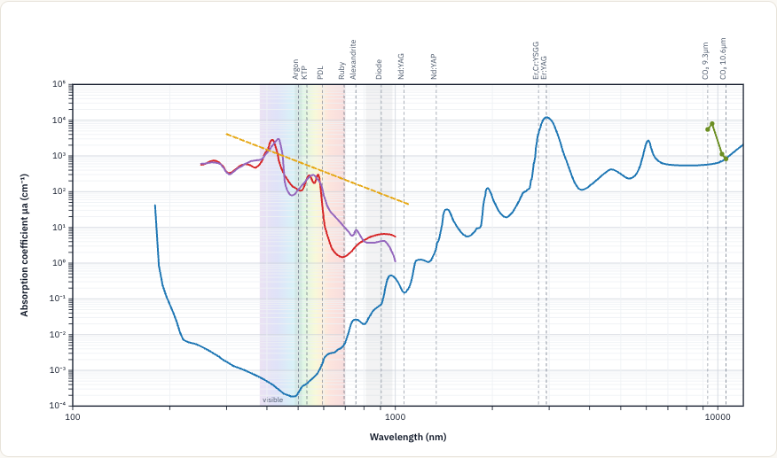

# Photolyze

**Live:** https://absorption-spectra-viewer.vercel.app

A **data-driven, programmatically controllable interactive SVG** visualization of laser–tissue
absorption spectra. The rendering **engine is generic** (any number of curves on a log-log
scientific plot); the laser–tissue dataset is just the first JSON fed into it. **Swap the JSON to
draw anything.**

Built for the selective-photothermolysis question: *which laser wavelength is preferentially
absorbed by which tissue chromophore?*



## What it does

| Input | Method | Status |
|---|---|---|
| ① Look up μa at a wavelength | `queryAt(nm)` / hover the chart | ✅ |
| ② Semantic zoom (re-tick + redraw a band, not a bitmap zoom) | `zoomTo(from, to)` | ✅ |
| ③ Choose which curves are shown | `setVisibleCurves([...])` / `toggleCurve(id, on)` | ✅ |
| ④ Laser positioning (vertical wavelength markers) | `showLasers('all' \| 'none' \| [ids])`; **click a marker / `selectLaser(id)`** highlights it and reads μa there | ✅ |
| ⑤ Two-wavelength comparison (μa fold-difference) | `compareWavelengths(a, b, curveId)` | ✅ |
| ⑥ Concentration scaling | `setConcentration(id, ×)` | ⚠️ reserved, disabled by default |

**Every layer is an input.** Curves are the data layer — feed any chromophore in with `upsertCurve(curve)`
(or a whole `Dataset`); lasers are selectable; the chart itself is the zoom control.

**Direct chart interaction:** hover to read μa · **drag across the chart to zoom** · scroll to zoom in/out ·
double-click to reset · click a laser marker to select it.

Out of scope by design: scattering (μs′), penetration depth, pulse/TRT timing, treatment-outcome
simulation. The data model reserves room for concentration only; nothing else is stubbed.

## Quick start

```bash
npm install
npm run dev        # run the app at http://localhost:5173
npm test           # 64 unit tests (engine math, query, render, parse, data sanity)
npm run typecheck
npm run build      # build the web app -> dist/ (deployable static site)
npm run build:lib  # build the reusable engine -> lib/ (ESM + UMD)
npm run data       # re-fetch + rebuild data/laser-tissue.json from sources
```

## Usage

```ts
import { AbsorptionSpectrum } from 'photolyze';
import dataset from 'photolyze/data/laser-tissue.json'; // or your own

const chart = new AbsorptionSpectrum('#chart', dataset, { interactiveQuery: true });

chart.queryAt(532);                       // { water: 4.27e-4, oxyhemoglobin: 233.8, ... }
chart.zoomTo(2700, 3000);                 // semantic zoom into the Er-laser band (or just drag on the chart)
chart.setVisibleCurves(['water', 'melanin']);
chart.showLasers(['eryag', 'ercrysgg']);  // mark Er:YAG + Er,Cr:YSGG
chart.selectLaser('eryag');               // highlight Er:YAG + read μa of every curve at 2940 nm
chart.compareWavelengths(2940, 2780, 'water'); // -> { foldDifference: 2.86, higherAt: 2940, ... }
chart.resetZoom();
```

### Filling in a curve later (the data layer is an input)

Curves with no reliable data yet (collagen, protein) are declared as gaps, not faked. The moment you
have a real μa table, feed it in — no engine change, it renders and becomes queryable immediately:

```ts
chart.upsertCurve({
  id: 'collagen',                    // promotes it out of "unavailable" automatically
  label: 'Collagen (type I)',
  color: '#0a8a0a',
  points: [[1500, 2.1], [1700, 5.4], [2940, 31]], // [nm, μa cm⁻¹] from your source
  source: { ref: 'Your citation here' },
});
chart.removeCurve('collagen');       // or take it back out
```

For end users, the app ships an **Add data** panel that parses pasted/uploaded `nm, μa` text (or
`[[nm,μa],…]`) into a curve. The parser is exported and validates the log-log invariants (≥2 points,
positive values, ascending, deduped):

```ts
import { parsePoints } from 'photolyze';
const points = parsePoints('1500, 2.1\n1700, 5.4\n2940, 31'); // -> [[1500,2.1],[1700,5.4],[2940,31]]
```

### Headless / server-side SVG

The renderer is a pure string builder — no DOM needed:

```ts
import { renderToSVGString } from 'photolyze';
const svg = renderToSVGString(dataset, { query: 2940, lasers: 'all' });
```

## Feeding your own data

The `Dataset` is the swappable unit (`src/types.ts`):

```ts
interface Dataset {
  meta: { title; description; wavelengthUnit: 'nm'; absorptionUnit: 'cm^-1'; references: string[] };
  curves: Curve[];          // continuous reference spectra
  lasers: Laser[];          // discrete wavelength markers
  unavailableCurves?: UnavailableCurve[]; // components with no reliable data (declared gaps)
}

interface Curve {
  id; label; color;
  points: [wavelengthNm, mua_cm⁻¹][];     // ascending by wavelength
  source: { ref; url?; note? };           // provenance is required
  gaps?: { fromNm; toNm; reason }[];       // never interpolated across
  modelFormula?: string;                   // set if points come from a fit, not measurement (drawn dashed)
  // reserved concentration dimension (⑥):
  epsilon?: [nm, cm⁻¹/M][]; defaultConcentration?; concentrationUnit?; concentrationFormula?;
  enabledByDefault?: boolean;
}
```

Then: `new AbsorptionSpectrum('#chart', myDataset)` or `chart.setDataset(myDataset)`.

## Data accuracy (the project's make-or-break point)

Rules followed, no exceptions:

1. **No eyeballing off figures** — log-axis point-picking can be tens of % wrong. All values come
   from original tabulated data or published equations.
2. **No fabricated points.** Where literature gives no reliable μa, the gap is declared, not filled.
   寧缺勿假 (better a marked gap than a fake number).
3. Every curve carries its **source, unit, and reference**.
4. Everything is **absolute μa (cm⁻¹)**, with conversions documented.

### Curves and their sources

| Curve | Source | Range | Confidence |
|---|---|---|---|
| H₂O (Water) | Segelstein (1981) / Hale & Querry (1973), OMLC — tabulated μa | 180–12000 nm | High |
| HbO₂ / Hb | Prahl / Gratzer / Kollias, OMLC — molar ε → μa @150 g/L whole blood | 250–1000 nm | High |
| Melanin | Jacques, OMLC — power-law fit `μa = 1.70e12·λ⁻³·⁴⁸` (drawn dashed) | 300–1100 nm | High (model) |
| Hydroxyapatite / enamel | Zuerlein, Fried, Featherstone, Seka (1998/1999) — mid-IR | 9300–10600 nm | Medium (as-cited) |

### Declared gaps (no reliable tabulated μa — not plotted)

- **Collagen** and **Protein**: real μa is either figure-only/paywalled (collagen, 500–1700 nm) or
  simply not in any tissue-optics model (protein). Only band *positions* are known. Shown greyed in
  the legend; full reasoning and citations in **[`data/SOURCES.md`](data/SOURCES.md)**.

### Physics cross-checks (encoded as tests in `test/dataset.test.ts`)

- 2940 nm: water μa ≈ 1.2×10⁴ cm⁻¹ (Er:YAG peak).
- 1064 nm: optical window — water 0.15, melanin ~50, hemoglobin low.
- 532 nm: HbO₂ & melanin absorb >1000× more than water.
- 2940 vs 2780 nm: water absorbs **2.86×** more — the ~300% "deeper into water" claim from the
  source dynamic figure (data gives 2.86×, not exactly 3×; data accuracy wins over the schematic).
- HA: 9.6 µm phosphate band ≈ 10× stronger than 10.6 µm.

> Reconstructing from real literature makes the chart differ from any single source figure — those
> are multi-paper simplified schematics. **Data accuracy wins; source figures are layout reference only.**

## Project structure

```
src/
  types.ts        data contract
  scales.ts       log scale + adaptive tick generation (decade vs nice-linear)
  interpolate.ts  log-log interpolation, gap/domain aware
  query.ts        queryAt + compareWavelengths (pure)
  render.ts       renderToSVGString + computeGeometry (pure, headless)
  spectrum.ts     AbsorptionSpectrum component (DOM + interaction)
  index.ts        public API
data/
  laser-tissue.json   the dataset
  SOURCES.md          provenance, units, gaps
scripts/          data fetch/convert/build (re-runnable: npm run data)
app/, index.html  the web app (uses the engine)
test/             unit tests
docs/             how-it-was-built: handoff prompt, plan, conversation log, source figures
  docs/reference/  the 5 source figures (layout/trend reference only)
```

## License

MIT
